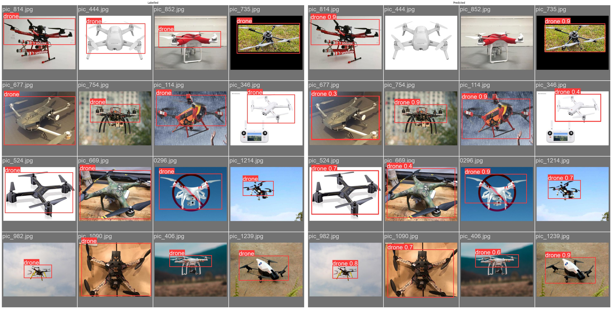

# Drone detection using Yolov10

## Notebook

https://nbviewer.org/github/Anant-mishra1729/YOLOv9-Drone-detection/blob/main/Yolov9_drone_detection.ipynb

## Open in Colab

### Best weights: [Yolov10n (20 epochs)](Weights/yolov10n_best.pt)

## Results

### Sample predictions

